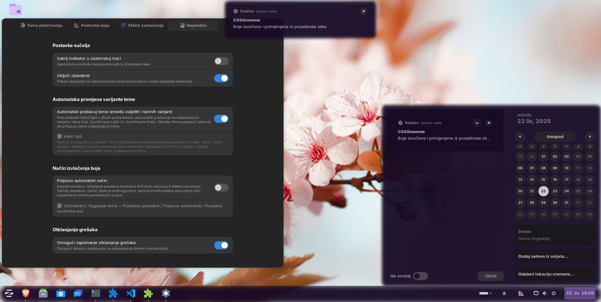

# CSS Gnommé - Dynamic Theme Overlay for GNOME Shell

> 🎉 ZorinOS 18 / GNOME 46+ Version (v2.5.3)
> Latest Stable: Manual Icon Theme Override + Dynamic Shadow-Strength

CSS Gnommé is a powerful GNOME Shell extension for Zorin OS 18 (GNOME 46+) that creates a dynamic overlay theme system with automatic wallpaper color extraction, advanced blur effects, and customizable transparency. It enhances your desktop appearance without modifying the original theme files, making it completely reversible.

## 📦 Version Status

- **Latest Stable:** v2.5.3 (GNOME 46+) - Icon Override + Shadow-Strength Fix
- **Legacy Version:** v1.5 (GNOME 43-44) - Available for ZorinOS 17

## 📈 Recent Achievements

- ✅ **Dynamic Shadow-Strength** - Fixed non-functional control (bug since v2.0!)
- ✅ **Manual Icon Theme Override** - Select icon theme independently from GTK theme
- ✅ **Preferences UI Reorganization** - Cleaner layout, Zorin features grouped
- ✅ **Zorin Menu Layout Control** - 5 layout styles (v2.5.2)
- ✅ **Quick Settings Enhancements** - Border-radius sync, compact height, dynamic updates (v2.5.1)
- ✅ **Minimal Mode** - Wallpaper accent ONLY for core widgets (v2.5.0)
- ✅ **Constants Refactoring** - 35+ magic numbers eliminated (v2.5.0)
- ✅ **6x Performance Boost** - Accent color cache (97.3% hit rate)

---

## ✨ Features

### 🔄 Dynamic Theme Overlay System

- **Non-Destructive:** Creates a custom theme overlay that inherits from your current GTK theme
- **Live Updates:** Automatically updates CSS when settings change
- **One-Click Toggle:** Enable/disable the overlay system without losing your configuration
- **Theme Preservation:** Automatically restores your original theme when disabling the overlay

### 🎨 Automatic Wallpaper Color Extraction

- **Smart Analysis:** Automatically extracts dominant and accent colors from your desktop background using advanced K-means clustering algorithm
- **Intelligent Application:** Applies extracted colors to panel backgrounds, popup menus, and accent borders
- **Light/Dark Detection:** Automatically adjusts color intensity based on your theme brightness
- **Manual Control:** Extract colors on-demand with one click from the system tray menu

### 🌫️ Advanced Styling Effects

- **Full Backdrop Control:** Adjust blur radius (1-50px), saturation, contrast, and brightness independently
- **Custom Tinting:** Apply semi-transparent color overlays for unique glass effects
- **Border Customization:** Define border color, width, and opacity for framed appearance (0-5px)
- **Shadow Control:** Dynamic shadow-strength (0.0-1.0) with ratio-based scaling for visual hierarchy ✨ NEW in v2.5.3
- **Universal Application:** Effects apply to panels, popup menus, Alt+Tab switcher, and other shell elements

### 🖥️ ZorinOS Integration

- **Taskbar Enhancement:** Special integration with Zorin Taskbar for consistent styling
- **Panel Margin Control:** Adjust panel margins for floating mode (0-32px)
- **Opacity Sync:** Synchronize opacity with Zorin Taskbar settings
- **Border Radius:** Synchronize rounded corners for modern appearance (0-25px)
- **Tint Control:** Adjust Zorin theme color tint intensity (0-100%) for more neutral or vibrant appearance
- **Menu Layout Control:** Choose from 5 Zorin Menu layout styles (ALL, MINT, APP_GRID, APPS_ONLY, SYSTEM_ONLY)
- **Icon Theme Override:** Select icon theme independently from GTK theme ✨ NEW in v2.5.3

### 🎛️ Customizable Transparency

- **Panel Opacity:** Control main taskbar/panel transparency (0-100%)
- **Menu Opacity:** Separate opacity control for popup menus
- **Color Overrides:** Manually set panel and popup background colors with full RGBA support
- **Border Radius:** Apply rounded corners for modern appearance (0-25px)
- **Quick Settings Sync:** Quick Settings elements match panel border-radius with scaling factors

---

## 🖼️ Screenshots


---



---

**Additional Screenshots:**

- [Auto Mode](docs/screenshot-appmenu-automode-dark.png)
- [Auto Mode Calendar](docs/screenshot-calendar-automode-dark.png)
- [More examples in docs/](docs/)

---

## 🔧 Requirements

**Supported GNOME Shell Versions:**

- GNOME 45, 46, or 47
- ZorinOS 18 (recommended for full Zorin Taskbar integration)
- Any modern Linux distribution with GNOME 46+ should work

**Tested On:**

- ZorinOS 18 Core (Primary target)

---

## 📥 Installation

### Option 1: GNOME Extensions Website (Recommended)

1. Visit [extensions.gnome.org](https://extensions.gnome.org/)
2. Search for "CSS Gnommé"
3. Click the toggle switch to install
4. Enable in GNOME Extensions app

### Option 2: Manual Installation

```bash
# Download latest release
wget https://github.com/drdrummie/CSSGnomme-ZorinOS18/releases/cssgnomme@dr.drummie.zip

# Install extension
gnome-extensions install cssgnomme@dr.drummie.zip

# Enable extension
gnome-extensions enable cssgnomme@dr.drummie

# Restart GNOME Shell
# X11: Alt+F2, type 'r', press Enter
# Wayland: Log out and log back in
```

### Option 3: Build from Source

```bash
git clone https://github.com/drdrummie/CSSGnomme-ZorinOS18.git
cd CSSGnomme-ZorinOS18
make install
```

Then restart GNOME Shell and enable the extension.

---

## 🚀 Quick Start

### Getting Started

1. **Enable the Extension:** Use GNOME Extensions app or the system tray icon
2. **Open Preferences:** Click the system tray icon → "Open Settings"
3. **Enable Overlay:** Toggle "Enable Overlay Theme" to activate
4. **Extract Colors:** Click "Extract Colors from Wallpaper" for automatic theming
5. **Customize:** Adjust transparency, blur effects, and colors to your liking

### Quick Actions (System Tray Menu)

- **Extract Colors from Wallpaper:** One-click color extraction
- **Enable/Disable Overlay:** Quick toggle without opening preferences
- **Open Settings:** Open full settings dialog

For detailed setup instructions, see [Quick Guide](docs/QUICK_GUIDE_ZOS18.md).

---

## 🔧 Troubleshooting

**Extension not appearing after install:**

- Restart GNOME Shell (Alt+F2 → 'r' on X11, or logout/login on Wayland)
- Check if enabled: `gnome-extensions list --enabled | grep cssgnomme`

**Colors not extracting:**

- Ensure wallpaper is set (not solid color background)
- Try manual extraction via extension menu
- Check logs: `journalctl -f -o cat /usr/bin/gnome-shell | grep CSSGnomme`

**Zorin integration not working:**

- Ensure Zorin Taskbar extension is enabled
- Check both extensions are on same GNOME Shell version
- Restart GNOME Shell after enabling both

**Performance issues:**

- Reduce blur radius (lower values = better performance)
- Disable "Auto-extract on wallpaper change" if not needed

**Advanced Troubleshooting:**

```bash
# Check extension logs
journalctl -f -o cat /usr/bin/gnome-shell | grep CSSGnomme

# Reset all settings
dconf reset -f /org/gnome/shell/extensions/cssgnomme/

# List enabled extensions
gnome-extensions list --enabled
```

---

## ⚠️ Known Limitations | Issues

- **Theme Compatibility:** Overlay theme inherits from current GTK theme (some themes may have compatibility issues)
- **Fluent GTK Themes:** Missing icons if Fluent icon theme not installed → SOLVED with manual icon override (v2.5.3)
- **Color Extraction:** Requires valid image wallpaper (not solid colors or gradients)
- **Zorin Integration:** Full integration requires ZorinOS 18 / GNOME 46+
- **Zorin Taskbar Border-Radius:** Zorin taskbar uses inline styles and javascript, border-radius has step of 5 (flat | 5px | 10px | 15px - default | 20px | 25px+). CSS Gnommé uses normal border radius but tries to adapt to Zorin taskbar. Setting border-radius to zero returns default Zorin's 15px (even without extension installed).
- **Performance:** Complex blur effects may impact performance on older hardware

---

## 💡 Tips & Tricks

**Best Performance:**

- Use moderate blur radius (10-20px) for best balance
- Disable auto-color extraction if you don't change wallpapers often
- Adjust shadow-strength to balance visual appeal and performance

**Visual Consistency:**

- Match border-radius across all elements for cohesive look
- Use extracted colors for best integration with wallpaper
- Adjust saturation for more vibrant or muted appearance

**Power User Features:**

- Use Manual Icon Theme Override for themes without matching icon packs
- Adjust Zorin Menu layout for different workflows (MINT, APP_GRID, etc.)
- Fine-tune shadow-strength (0.1 for minimal, 0.4 default, 1.0 for max glow)

---

## 📄 License

This project is licensed under the GNU General Public License v3.0 or later - see [LICENSE](LICENSE) for details.

---

## 👤 Author

**drdrummie**

- GitHub: [@drdrummie](https://github.com/drdrummie)
- Repository: [CSSGnomme-ZorinOS18](https://github.com/drdrummie/CSSGnomme-ZorinOS18)

---

## 🙏 Acknowledgments

- GNOME Shell team for the extension API
- Zorin OS team for the excellent desktop environment
- Open Bar extension for color extraction inspiration
- CSS Panels extension (Cinnamon)

---

**Enjoy your customized GNOME Shell experience!** ✨
