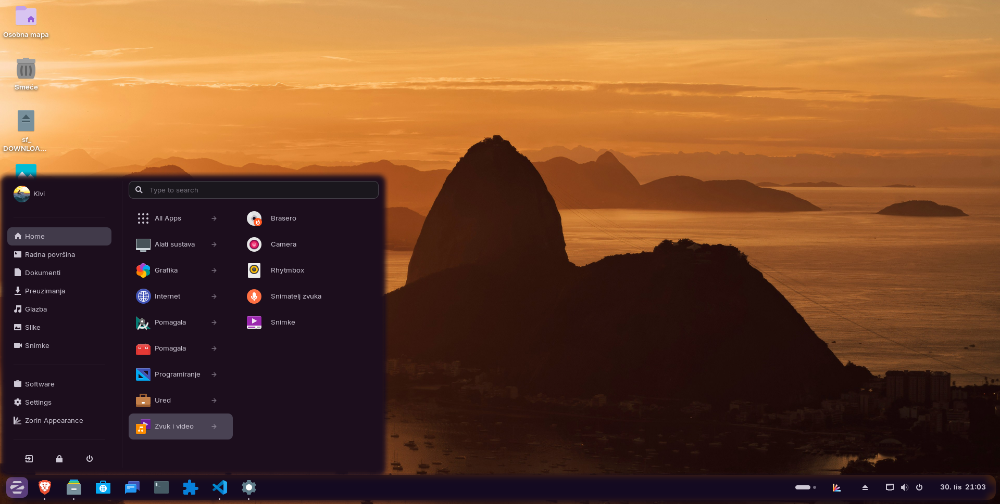

# CSS Gnommé - Dynamic Theme Overlay for GNOME Shell

**CSS Gnommé** is a GNOME Shell extension for **GNOME 45-47** (ZorinOS 18) that creates dynamic theme overlays with automatic wallpaper color extraction, advanced blur effects, and customizable transparency. Enhance your desktop appearance without modifying original theme files - everything is completely reversible.



---

## ✨ Features

### 🔄 **Dynamic Theme Overlay System**

- **Non-Destructive**: Creates a custom theme overlay that inherits from your current GTK theme
- **Live Updates**: Automatically updates CSS when settings change
- **One-Click Toggle**: Enable/disable the overlay system without losing your configuration
- **Theme Preservation**: Automatically restores your original theme when disabling the overlay

### 🎨 **Automatic Wallpaper Color Extraction**

- **Smart Analysis**: Automatically extracts dominant and accent colors from your desktop background using advanced K-means clustering algorithm
- **Intelligent Application**: Applies extracted colors to panel backgrounds, popup menus, and accent borders
- **Light/Dark Detection**: Automatically adjusts color intensity based on your theme brightness
- **Manual Control**: Extract colors on-demand with one click from the system tray menu

### 🌫️ **Advanced Styling Effects**

- **Full Backdrop Control**: Adjust blur radius (1-50px), saturation, contrast, and brightness independently
- **Custom Tinting**: Apply semi-transparent color overlays for unique glass effects
- **Border Customization**: Define border color, width, and opacity for framed appearance (0-5px) and custom visual appearance
- **Universal Application**: Effects apply to panels, popup menus, Alt+Tab switcher, and other shell elements

### 🖥️ **ZorinOS Integration**

- **Taskbar Enhancement**: Special integration with Zorin Taskbar for consistent styling
- **Panel Margin Control - Floating Mode**: Adjust panel margins for floating mode (0-32px)
- **Opacity Sync**: Synchronize opacity with Zorin Taskbar settings
- **Border Radius**: Syncronize rounded corners for modern appearance (0-25px) with Zorin Taskbar settings

### 🎛️ **Customizable Transparency**

- **Panel Opacity**: Control main taskbar/panel transparency (0-100%)
- **Menu (Popup) Opacity**: Separate opacity control for popup menus
- **Color Overrides**: Manually set panel and popup background colors with full RGBA support
- **Border Radius**: Apply rounded corners for modern appearance (0-25px)

---

## 🖼️ Screenshots

**Additional Screenshots:**

- [Auto Mode](docs/screenshot-appmenu-automode-dark.png)
- [Auto Mode Calendar](docs/screenshot-calendar-automode-dark.png)
- [More examples in docs/](docs/)

---

## 🔧 Requirements

**Supported GNOME Shell Versions:**

- GNOME 45, 46, or 47
- ZorinOS 18 (recommended for full Zorin Taskbar integration)
- Any modern Linux distribution with GNOME 46+

**Tested On:**

- ZorinOS 18 Core (Primary target)

---

## 📥 Installation

### Option 1: GNOME Extensions Website (Recommended)

1. Visit [extensions.gnome.org](https://extensions.gnome.org/)
2. Search for "CSS Gnommé"
3. Click the toggle switch to install
4. Enable in GNOME Extensions app

### Option 2: Manual Installation

```bash
# Download latest release
wget https://github.com/drdrummie/CSSGnomme-ZorinOS18/releases/cssgnomme@dr.drummie.zip

# Install extension
gnome-extensions install cssgnomme@dr.drummie.zip

# Enable extension
gnome-extensions enable cssgnomme@dr.drummie

# Restart GNOME Shell
# X11: Alt+F2, type 'r', press Enter
# Wayland: Log out and log back in
```

### Option 3: Build from Source

```bash
git clone https://github.com/drdrummie/CSSGnomme-ZorinOS18.git
cd CSSGnomme-ZorinOS18
make install
```

Then restart GNOME Shell and enable the extension.

---

## 🚀 Quick Start

### Getting Started

1. **Enable the Extension**: Use GNOME Extensions app or the system tray icon
2. **Open Preferences**: Click the system tray icon → "Open Settings"
3. **Enable Overlay**: Toggle "Enable Overlay Theme" to activate
4. **Extract Colors**: Click "Extract Colors from Wallpaper" for automatic theming
5. **Customize**: Adjust transparency, blur effects, and colors to your liking

### Quick Actions (System Tray Menu)

- **Extract Colors from Wallpaper**: One-click color extraction
- **Enable/Disable Overlay**: Quick toggle without opening preferences
- **Open Settings**: Open full settings dialog

For detailed setup instructions, see [Quick Guide](docs/QUICK_GUIDE_ZOS18.md).

---

## 🔧 Troubleshooting

**Extension not appearing after install:**

- Restart GNOME Shell (Alt+F2 → 'r' on X11, or logout/login on Wayland)
- Check if enabled: `gnome-extensions list --enabled | grep cssgnomme`

**Colors not extracting:**

- Ensure wallpaper is set (not solid color background)
- Try manual extraction via extension menu
- Check logs: `journalctl -f -o cat /usr/bin/gnome-shell | grep CSSGnomme`

**Zorin integration not working:**

- Ensure Zorin Taskbar extension is enabled
- Check both extensions are on same GNOME Shell version
- Restart GNOME Shell after enabling both

**Performance issues:**

- Reduce blur radius (lower values = better performance)
- Disable "Auto-extract on wallpaper change" if not needed
- Clear cache via Preferences → Advanced → Clear Theme Cache

**Advanced Troubleshooting:**

```bash
# Check extension logs
journalctl -f -o cat /usr/bin/gnome-shell | grep CSSGnomme

# Reset all settings
dconf reset -f /org/gnome/shell/extensions/cssgnomme/

# List enabled extensions
gnome-extensions list --enabled
```

---

## ⚠️ Known Limitations

- **Theme Compatibility**: Overlay theme inherits from current GTK theme (some themes may have compatibility issues)
- **Color Extraction**: Requires valid image wallpaper (not solid colors or gradients)
- **Zorin Integration**: Full integration requires ZorinOS 18 / GNOME 46+
- **Performance**: Complex blur effects may impact performance on older hardware

See [CHANGELOG.md](docs/CHANGELOG.md) for version history and detailed release notes.

---

## 💡 Tips & Tricks

**Best Performance:**

- Use moderate blur radius (10-20px) for best balance
- Disable auto-color extraction if you don't change wallpapers often

**Visual Consistency:**

- Match border-radius across all elements for cohesive look
- Use extracted colors for best integration with wallpaper
- Adjust saturation for more vibrant or muted appearance

---

## 📄 License

This project is licensed under the **GNU General Public License v3.0 or later** - see [LICENSE](LICENSE) for details.

---

## 👤 Author

**dr.drummie**

- GitHub: [@drdrummie](https://github.com/drdrummie)
- Repository: [CSSGnomme-ZorinOS18](https://github.com/drdrummie/CSSGnomme-ZorinOS18)

---

## 🙏 Acknowledgments

- GNOME Shell team for the extension API
- Zorin OS team for the excellent desktop environment
- Open Bar extension for color extraction inspiration
- CSS Panels extension for Cinnamon Mint

---

**Enjoy your customized GNOME Shell experience!** ✨
